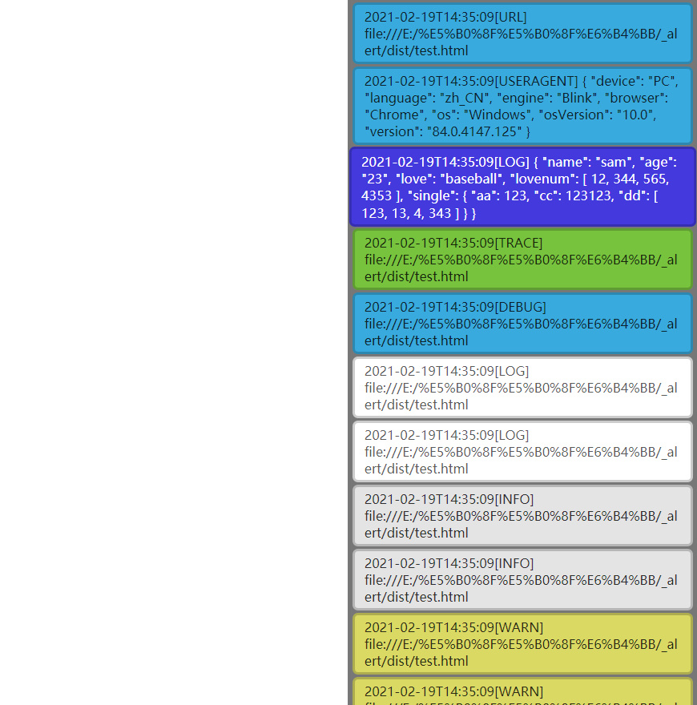
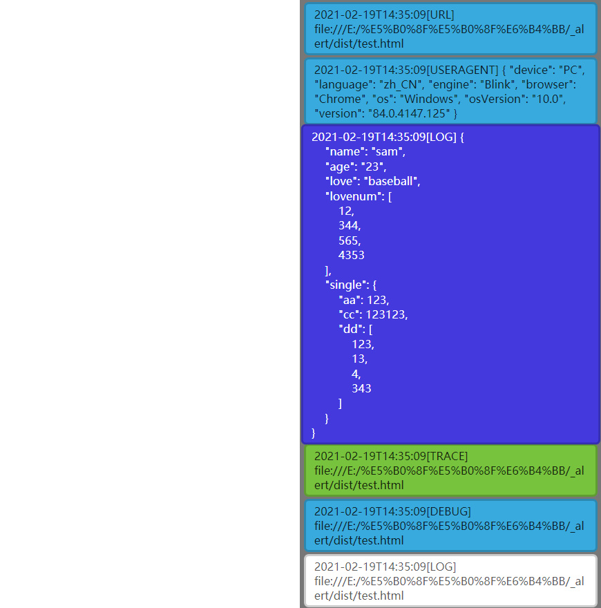

English | [简体中文](./README_CN.md)

aconsole
==============================

A lightweight tool of simulating console for STB(no console and alert environment)

## contributor and initial conception: [gongxw](https://github.com/gongxw)

## Features

- view console logs
- custom options(position, color, background, size, focus)

## Function

- [x] custom background: color, position, size, z-index)
- [x] custom log: fontsize, focus model, page turning, object formatting
- [x] catch error
- [x] clear && clearAll
- [x] show && hide
- [x] UserAgent

## Usage
```
npm install aconsole
```

Import dist/aconsole.min.js to your project:

```html
<script src="path/to/aconsole.min.js"></script>
<script>
  // init vConsole
  
  var _aconsole = new aconsole();
  _aconsole.show()
  _aconsole.log("hello world") 
  _aconsole.trace("hello world") 
  _aconsole.debug("hello world")
  _aconsole.info("hello world")
  _aconsole.warn("hello world")
  _aconsole.error("hello world")
  // example: match key event
  document.addEventListener("keydown", function (event) {
    var code = event.keyCode;
    if (code == 13) {
      // _mconsole.clearAll();
      _mconsole.toggle();
      // _mconsole.clear();
    }
    if (code == 32) {
      _mconsole.log(document.createElement("div"), 2);
    }
    if (code == 34) {
      _mconsole.pageDown();
    }
    if (code == 33) {
      _mconsole.pageUp();
    }
    if (code == 40) {
      _mconsole.moveDown();
    }
    if (code == 38) {
      _mconsole.moveUp();
    }
  });
</script>
```

## configuration

```javascript
var options = {
  position: "left", // console position: right && top && bottom
  size: "50%", // console size 
  id: "console", // console dom id
  parent: "body", // binding parent dom (body, ID, class)
  focus: true, // focus model, default: false
  zindex: 9999, // default: 9999
  spread: true, // defaul: false
  bgcolor: "rgba(85,85,85,.8)",
}
new aconsole(options) // unnecessarily
```

## all methods
- show() && hide()
- log(data, level) // level: 1: error, 2: warn, 3: info, 4: log, 5: debug, 6: trace
- trace(data)
- debug(data)
- error(data)
- info(data)
- trace(data)
- getDom() // get console dom
- clearAll() // clear all log
- clear() // clear focused log, (focus: true)
- pageDown() && pageUp() // page turning log
- moveDown() && moveUp() // focus log move (focus: true)
- toggle() // format focused when data typeof === Object show (focus: true)

## toggle before:



## toggle after:
